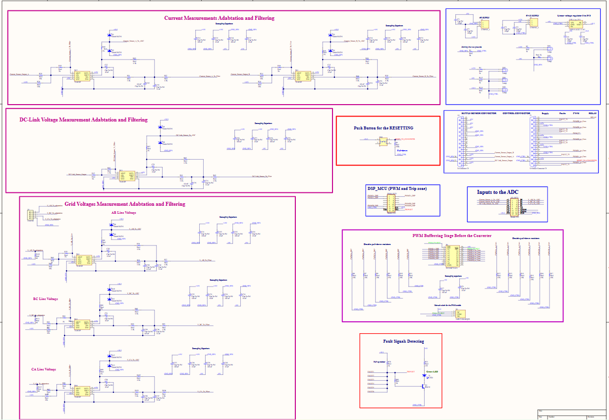
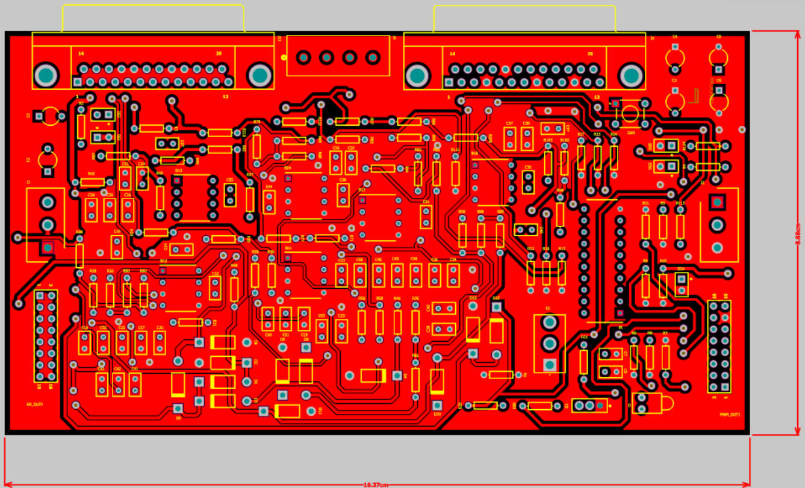
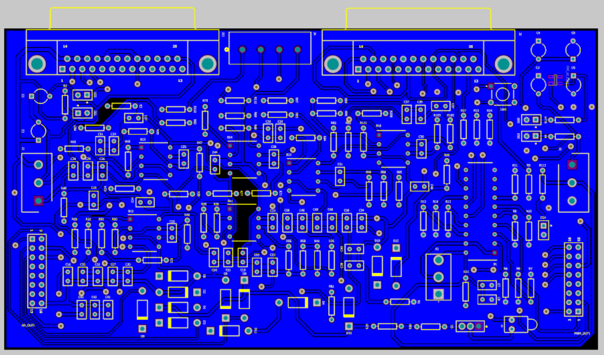
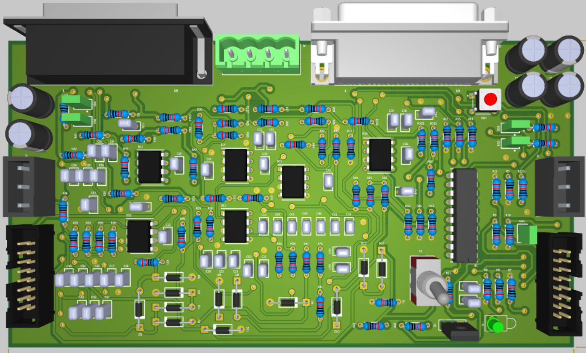
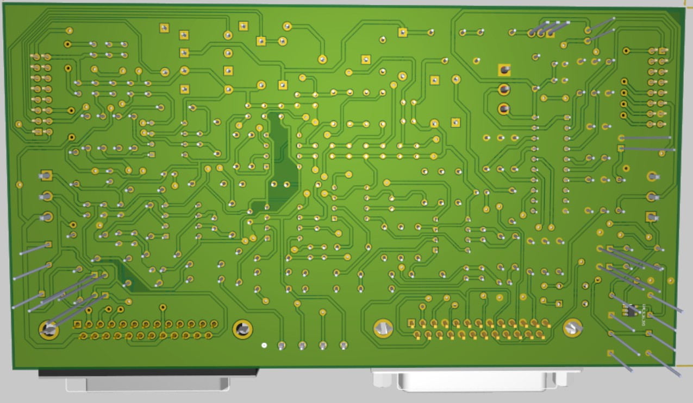

# Grid-Connected Inverter PCB Design (Altium)

## Overview
This project involves the design of printed circuit boards (PCBs) for controlling a grid-connected power electronic converter. The design was implemented using Altium Designer and integrates signal conditioning, protection circuits, ADC interfacing, and PWM generation for real-time control applications.

---

## Objective
- Design a PCB for control of a grid-connected inverter  
- Implement signal conditioning and filtering circuits  
- Integrate protection mechanisms for safe operation  
- Enable ADC interfacing for measurement and control  
- Generate PWM signals for power electronic switching  

---

## System Functionality

The PCB was designed to support:

- Signal adaptation and conditioning  
- Filtering of measurement signals  
- Protection against electrical faults  
- Analog-to-digital conversion (ADC) interfacing  
- PWM gate signal generation for converter control  

This ensures seamless integration between the control system and power electronic hardware.

---

## Schematic Design

- Complete circuit schematic designed in Altium  
- Includes control, sensing, and protection circuits  
- Defines all electrical connections and component selection  

---

## PCB Layout

### Top Layer

- Component placement and routing for control signals  
- Optimized layout for signal integrity  

---

### Bottom Layer

- Grounding and return paths  
- Power routing and noise reduction  

---

## 3D PCB Visualization

### 3D Top View

- Visual representation of component placement  
- Helps verify mechanical layout  

---

### 3D Bottom View

- Shows underside routing and structure  
- Useful for fabrication validation  

---

## Design Considerations

- Proper grounding to reduce noise  
- Signal filtering for accurate measurements  
- Protection circuits for system safety  
- Efficient routing for PWM and control signals  
- Compact and practical layout for real implementation  

---

## Tools Used

- Altium Designer  

---

## Files

- Grid_Connected_Inverter_PCB_Altium_Design_Files.zip  

---

## Conclusion

This project demonstrates the complete design of a control PCB for a grid-connected inverter. The design integrates measurement, control, and protection functionalities, providing a practical foundation for real-time power electronics control systems.

---

## Author

Royalty Holyworth Chihava
